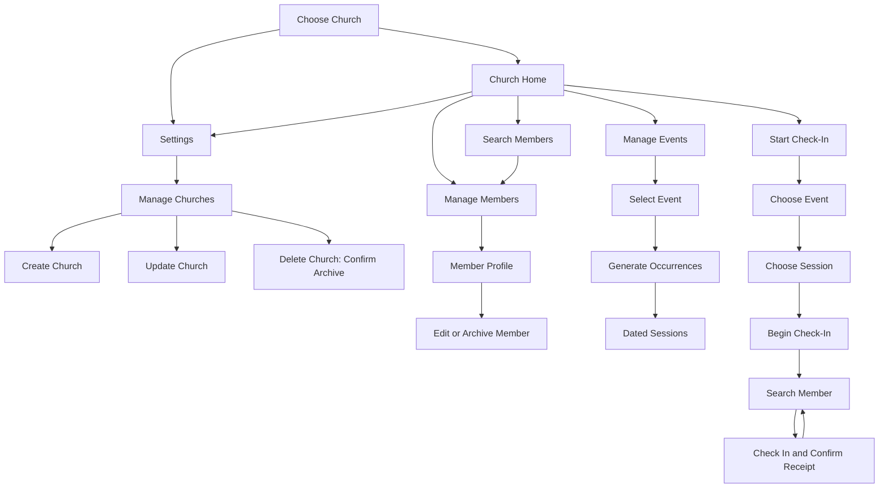

# Plan: JChurch React Native Mobile App

## Progress Tracking

Implementation lives under [src/JcChurchMobile](../src/JcChurchMobile/README.md). Feature checkboxes below track implemented code; the acceptance checklist tracks verification. Native-device and production-security gates remain open even where a browser workflow passes.

## 1. Scope And Stack

Build an Expo React Native app for iOS and Android, focused on church staff managing members, events, and check-in.

- [x] Use TypeScript and Expo Router for navigation.
- [x] Use TanStack Query for API requests, pagination, and church-scoped caching.
- [x] Use React Hook Form and Zod for forms and validation.
- [x] Generate API types from the [existing OpenAPI contract](../src/jchurchFunction/openapi.json).
- [x] Create the mobile project under `src/JcChurchMobile`.
- Initial scope is online-only, synthetic-data development. Authentication and church-specific staff permissions are prerequisites for real-data use.
- Defer offline synchronization, kiosks, guardian check-in, and cross-church attendance.

This plan extends the [church management API plan](church-management-api-plan.md) with a mobile client. It does not authorize deployment or changes to existing security safeguards.

## 2. Navigation And Visual Design

Church selection is always the first screen. After selection, show four bottom tabs: Home, Members, Events, and Check-In.

- [x] Add a gear-icon Settings button to the church-selection header and church Home header, with an accessible Settings label and a tooltip where supported. Settings opens Manage Churches without requiring a selected church.
- [x] Keep the selected church name visible in the header, with a church-switch action.
- [x] Home provides four clear actions: Manage Members, Search Members, Manage Events, and Start Check-In. Search opens Members with its search field focused.
- [x] Use white surfaces, charcoal text, teal primary actions, and restrained error indicators. Favor compact lists over dashboard cards.
- [x] Use readable typography, familiar icons with labels, native date pickers, and accessible touch targets.
- [ ] Verify Dynamic Type, VoiceOver/TalkBack, safe areas, keyboard avoidance, and Android back navigation on native devices. Controls and safe-area/keyboard handling are implemented.
- [x] Preserve list position when returning from details.
- [x] Church switching resets navigation, pending searches, and the active check-in session. Warn before discarding unsaved edits.

## 3. Church Selection

Flow: launch -> searchable church list -> select church -> church Home.

- [x] Show active churches as searchable, paginated name rows.
- [x] Highlight the previously selected church without automatically skipping this screen.
- [x] Include loading, empty, connection-error, retry, and pull-to-refresh states.

### Settings And Church Management

Flow: Settings -> Manage Churches -> Create Church or select an existing church -> Update Church / Delete Church.

- [x] Keep Settings available when there are no churches, so an administrator can create the first church.
- [x] Create Church: open a form with a required church name, trimmed and limited to 200 characters. Save through the API, refresh the church list, and let the user explicitly select the new church.
- [x] Update Church: open the selected church's current name for editing. Save with its exact ETag, refresh the lists and selected-church header, and retain form values on validation or network errors. On a stale-version conflict, offer reload and review rather than silently overwriting changes.
- [x] Delete Church: show a destructive action with confirmation naming the church. Explain that deletion archives the church, removes it from active selection, and prevents new check-ins; it does not permanently erase related records or attendance history. Use Archive Church as the final confirmation button to make the effect explicit. The current API provides no restore operation.
- [x] After confirmed deletion of the selected church, clear its selection, cached data, navigation, and active check-in session, then return to church selection. Ignore outstanding responses for that church. For another church, refresh the management and selection lists without changing the current selection.
- [x] Disable repeated submissions while a request is pending. Do not claim creation, update, or deletion succeeded before server confirmation, and warn before discarding unsaved edits.
- [ ] Before real-data use, enforce church-management permissions on the server: platform administrators can create churches; only explicitly authorized administrators can update or archive the relevant church. Hiding Settings actions is not an authorization boundary.

## 4. Member Management And Search

Flow: Members -> search/filter list -> member profile -> edit or archive.

- [x] Search by name using debounced server queries. Filter by group/subgroup and paginate results.
- [x] Provide an Add Member action. Require first and last names; support middle name, birth date, school, phone, email, group assignments, and church-defined custom fields.
- [x] Use typed controls for custom fields and validation. Retain entered values after failed saves.
- [x] Show group information to help distinguish members with identical names.
- [x] Label deletion Archive Member, require confirmation, and explain that attendance history remains.
- [x] Handle concurrent edits with a conflict message and reload/review flow, never silent overwriting.

## 5. Events And Occurrences

Flow: Events -> tap existing event -> event details and dated occurrences -> Generate Occurrences -> refreshed occurrence list.

Use Sessions as the user-facing label for occurrences, with dates, times, timezone, and cancellation status.

- [x] Tapping an event opens its schedule and sessions. A prominent generation action makes creation explicit rather than silently writing data when navigating.
- [x] After generation, show the number created, or "Sessions are already up to date." Do not automatically select a session for check-in.
- [x] Add Event captures name, local start, timezone, duration, and a simple recurrence choice: none, daily, weekly, monthly, or yearly.
- [x] Event details support renaming and archiving. Session details support rescheduling or cancellation where allowed.
- [x] Display times in the event timezone, explicitly labeled when different from the device timezone.
- [x] Include a Start Check-In action on a session detail screen that carries the selected event and session into the check-in confirmation step.

### Existing Backend Constraints

[EventService](../src/jchurchFunction/Services/EventService.cs) generates missing occurrences from seven days ago through the next 90 days. It does not create one arbitrary date from a tap. Repeated generation is duplicate-safe.

Schedules are immutable after event creation, and only future occurrences can be changed. A replacement event is needed for a changed recurring schedule. Custom one-off session creation would require a separate API enhancement and is outside the initial mobile scope.

## 6. Check-In Experience

Flow: Check-In -> select event -> select dated session -> Begin Check-In -> search member -> check in -> repeat.

- [x] Prioritize today's sessions, but allow other dates because the current API source does not restrict check-in by session time. Disable cancelled sessions for new check-ins.
- [x] Pin church, event, session date/time, and timezone above the member search.
- [x] Show each matching member with identifying group information and a clearly labeled Check In action.
- [x] After server confirmation, show Checked In and a timestamp. Keep the session open for the next member.
- [x] Repeated submissions show Already Checked In without creating duplicate attendance.
- [x] On timeout, show Confirmation pending. Check status or retry with the same member/session IDs. Never display success before persistence is confirmed.
- [x] Include a paginated Checked In view and a visible Change Session action.
- [x] Do not offer undo until a supporting API exists.
- [ ] Implement production staff authorization before real-data use. The initial workflow is staff-assisted, but accepting a member ID does not establish permission to act on that member's behalf.

## 7. Integration And Safety

Use the [existing API routes](../src/jchurchFunction/Functions/ChurchApi.cs) for churches, members, groups, custom fields, events, occurrence generation, check-in status, and attendance.

| Capability | API route relative to `/api/v1` |
| --- | --- |
| List/create churches | `GET/POST /churches` |
| Read/update/delete church (archive) | `GET/PUT/DELETE /churches/{churchId}` |
| Search/create members | `GET/POST /churches/{churchId}/members` |
| Read/update/archive member | `GET/PUT/DELETE /churches/{churchId}/members/{memberId}` |
| Load groups/custom fields | `GET /churches/{churchId}/groups` and `GET /churches/{churchId}/custom-fields` |
| List/create events | `GET/POST /churches/{churchId}/events` |
| Read/update/archive event | `GET/PUT/DELETE /churches/{churchId}/events/{eventId}` |
| List/generate occurrences | `GET/POST /churches/{churchId}/events/{eventId}/occurrences` |
| Read/override occurrence | `GET/PUT /churches/{churchId}/occurrences/{occurrenceId}` |
| Check in a member | `POST /churches/{churchId}/occurrences/{occurrenceId}/check-ins` with `{ "memberId": "..." }` |
| Confirm check-in status | `GET /churches/{churchId}/occurrences/{occurrenceId}/check-ins/{memberId}` |
| List attendance | `GET /churches/{churchId}/attendance` with occurrence and date filters |

- [x] Include church IDs in every scoped request and cache key. Ignore stale responses after church switching.
- [x] Send only writable fields. Use exact ETags in `If-Match` for updates and archives.
- [x] Handle continuation-token pagination, validation errors, stale edits, throttling, and unavailable services explicitly.
- [x] Filter attendance by an explicit check-in-date range and occurrence ID. The backend filters `checkedInAt`, not the session start; an old or future session can receive attendance today. Default the UI to today in UTC and allow another day. Individual report ranges cannot exceed 93 days.
- [x] Keep member data out of persistent caches and logs.
- [ ] Store future authentication tokens in secure device storage when authentication is implemented.
- [x] Configure simulator/device API addresses separately. Physical devices cannot use the computer's `localhost`; preserve current network restrictions and use synthetic data.
- [x] Display actionable retry states when offline. Do not queue offline check-ins or automatically retry non-idempotent resource creation after an uncertain response.

## 8. Delivery Phases

- [x] Phase 1 - Foundation: Expo setup, design tokens, navigation, API client, church selection, and Settings with church creation, updates, and deletion (archive).
- [x] Phase 2 - Members: searchable directory, profiles, creation, editing, archiving, and custom fields.
- [x] Phase 3 - Events: event forms, session generation/listing, and future-session changes.
- [x] Phase 4 - Check-In: session selection, rapid member processing, receipts, and timeout recovery.
- [x] Phase 5a - Automated foundation and browser verification: API/domain tests, desktop and phone-sized browser workflows, and web/iOS/Android bundle compilation.
- [ ] Phase 5b - Native verification: component/device tests and iOS/Android end-to-end flows, including text scaling, screen readers, keyboard/back behavior, and physical-device networking.
- [ ] Phase 6 - Release gate: authentication, authorized church access, staff and church-management permissions, dependency security review, privacy review, and approved backend access before any real-data pilot.

## 9. Acceptance Checklist

- [ ] Both iOS and Android start with the church selection screen.
- [x] Settings is accessible from church selection and church Home. Its entry point does not require an existing church.
- [x] Church creation, update, and archival pass the live browser workflow; ETag request handling is covered by API tests.
- [x] Deletion requires confirmation explaining archival; deleting the selected church returns to church selection in the browser workflow.
- [ ] Church-management authorization is enforced by the server before real-data use.
- [x] Selecting a church exposes member management, member search, event management, and check-in.
- [x] Church switching clears the prior directory in browser tests; query keys include the church scope.
- [x] Member creation/editing pass the live workflow; stale edits, draft retention, and pagination pass controlled browser tests.
- [ ] Exercise member archival, all custom-field types, and group assignments on native devices.
- [x] Event details expose schedules, sessions, and occurrence generation.
- [x] Generating occurrences twice creates sessions only on the first call in the live workflow.
- [x] Check-in requires explicit event and dated-session selection before processing members.
- [x] Repeated check-in returns Already Checked In; uncertain-outcome recovery is covered by API and controlled browser tests.
- [x] Cancelled sessions are blocked, and uncertain requests do not show unconfirmed success in controlled browser tests.
- [ ] Exercise future-session rescheduling/cancellation and unrestricted past/future check-in against a rebuilt API host.
- [ ] Navigation, forms, text scaling, screen readers, and keyboard behavior work on both platforms.
- [ ] Production authentication and authorization gates are met before real-data use.

Primary acceptance journey: select church -> add/find member -> select event -> generate sessions -> choose session -> check in member -> verify one attendance record even after retry.

## Implementation Verification

- [x] Strict TypeScript compilation and Expo dependency compatibility check pass.
- [x] Eleven API/domain tests pass.
- [x] Six browser cases pass across desktop and phone-sized Chromium: live management/check-in, controlled concurrency/isolation/pagination, and controlled uncertainty/cancellation.
- [x] Web, iOS, and Android bundles compile. Browser screenshots were inspected for layout; mobile tab-label bounds are tested.
- [ ] Complete native simulator/device verification. Local `simctl` is unavailable; browser mobile emulation does not replace native testing.
- [ ] Review 15 moderate dependency audit advisories before release. No forced SDK downgrades were applied.

The running API host still enforces an older check-in time window, unlike the current source. Live tests use a currently active synthetic session and leave the existing host running to preserve its in-memory data. No backend safeguards were changed, no production authentication was added, and nothing was deployed.
