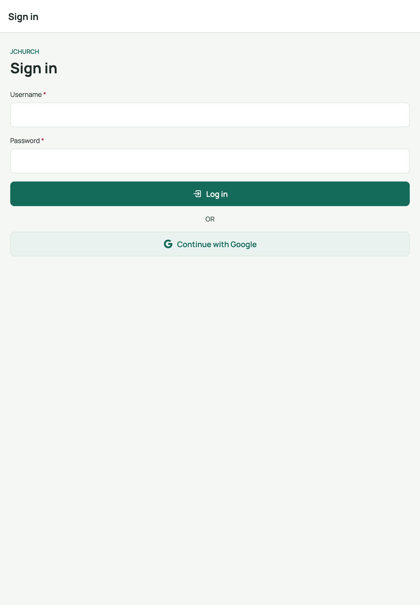
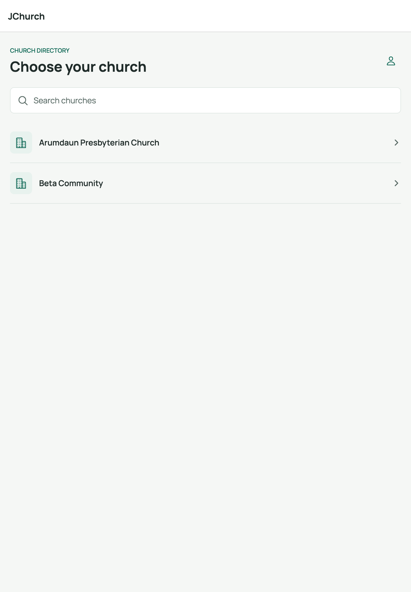

# 1. Sign in with your Google account

Use this guide to log in to the JChurch app with your Google account.

> **Before you start:** your Google account email must already be invited by an
> administrator. If it hasn't been, the app will tell you when you try to sign in —
> ask your administrator to add you first.

## Screen 1 — Sign in

When you open the app (or are signed out), you see the **Sign in** screen:

## Steps

1. Tap **Continue with Google** (the button with the Google "G" logo).
2. Your device opens the Google sign-in prompt. Choose the Google account that
   your administrator invited, and complete the sign-in.
3. The app checks that your Google email matches an invited user record:
   - **Match found** → you are signed in and taken to your church (or the church
     picker if you belong to more than one).
   - **No match** → the message
     *"This Google account hasn't been invited. Ask an administrator to add you first."*
     appears in a red box. Contact your administrator, then try again.
4. If sign-in is interrupted or fails for any other reason, you'll see
   *"Google sign-in failed. Please try again."* — just tap the button again.

> If you backed out of the Google prompt, nothing happens — no error is shown;
> simply tap **Continue with Google** again when you're ready.

## Screen 2 — Choose your church

If your account is linked to **one** church, you go straight to it. If you serve
at **multiple** churches, you'll see the church list first:

Tap a church to open it. You land on the **Home** tab with quick links, and the
tab bar (Home · Members · Events · Check-In · Reports) at the bottom.

## Switching churches or signing out later

- Tap the **switch church** button ([<]) in the top-left header (visible when you
  belong to more than one church) to pick a different church.
- Tap your **name/photo chip** in the top-right header to open **Settings**,
  where you can sign out.

## Related

- Next: [Member list, search & export](02-member-list-search-export.md)
- Back to: [User guide index](README.md)
