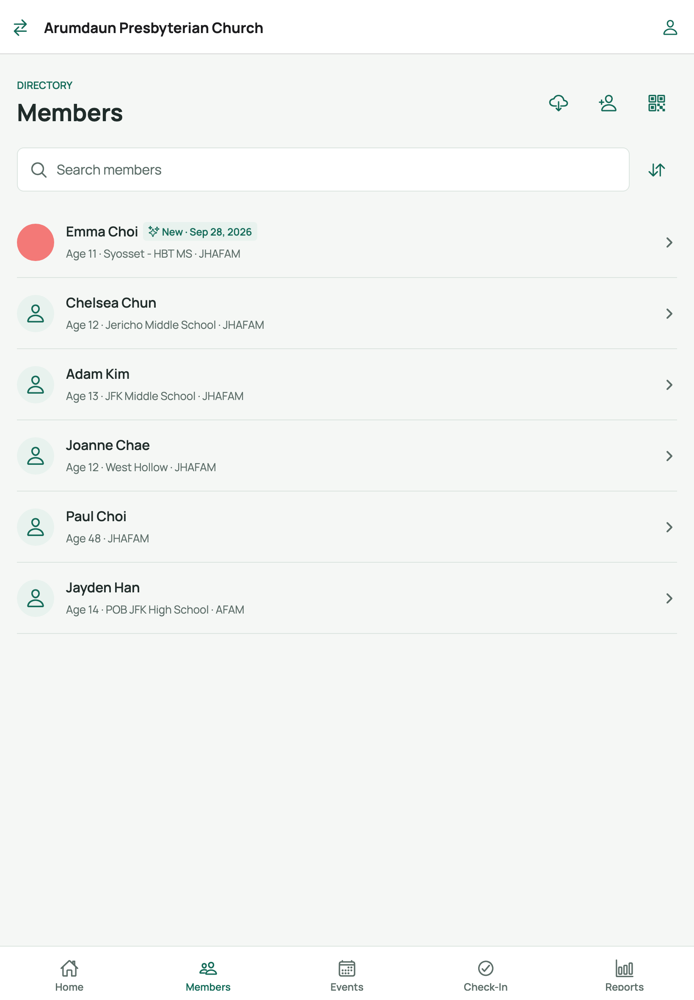
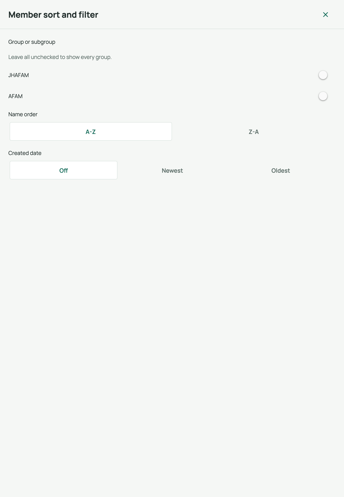
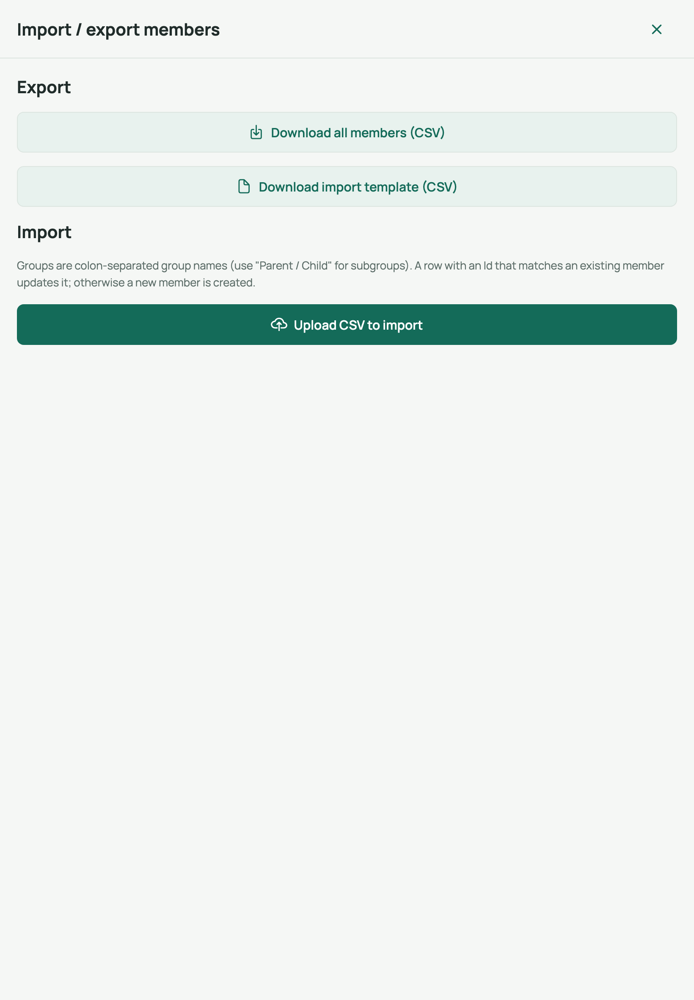

# 2. Member list, search & export

The **Members** tab is your church directory: find people, narrow the list, and
export it to a CSV spreadsheet file.

## Screen 1 — Members list

Open the **Members** tab:

Header action buttons (top right):

| Button | Label | What it does |
|--------|-------|--------------|
| [csv] | Import or export CSV | Opens the import/export sheet (below) |
| [add] | Add member | Creates a new member (see guide 3) |
| [QR] | New registration | Shows the registration QR code (see guide 5) |

Each row shows the member's **photo, name, age, school, and groups**. Badges:
- **New** — recently registered (the number of days is set by your church).
- **Guardian info incomplete** (red) — a child member whose guardian details are
  missing. Tap the row to complete the profile.

## Searching

1. Tap the **Search members** box at the top.
2. Type any part of a name — the list filters as you type (there's a brief pause
   before results update; that's normal).
3. Clear the text (tap the **x** in the box) to show everyone again.

## Sorting and filtering

Tap the **[sort]** button next to the search box to open the
**Member sort and filter** sheet:

- **Group or subgroup** — check one or more groups to show only their members.
  Leave everything unchecked to show the whole church.
- **Name order** — A-Z (default) or Z-A.
- **Created date** — Off, Newest first, or Oldest first.

The list updates as soon as you make selections. Close the sheet to return.

## Scrolling the full list

The list loads in batches. When more results exist, a **Load more members**
button appears at the bottom — tap it to fetch the next batch. Pull down at the
top of the list to refresh.

## Screen 2 — Export members (CSV)

Tap the **[csv] Import or export CSV** button to open the
**Import / export members** sheet:

### To export the directory

1. Tap **Download all members (CSV)**.
2. The file `members.csv` is produced:
   - **On the web** — it downloads straight to your browser's Downloads folder.
   - **On a phone/tablet** — the share sheet opens so you can save or send the
     file (Mail, Files, AirDrop, etc.).
3. Open the CSV in Excel, Numbers, or Google Sheets.

> The export always contains **all** members, regardless of the current search
> or filter.

### Related buttons in the same sheet

- **Download import template (CSV)** — a blank spreadsheet with the correct
  column headers for bulk-importing members.
- **Upload CSV to import** — pick a filled-in CSV to create many members at
  once. The list refreshes automatically when the import finishes.

## Related

- Next: [Member details, photo & groups](03-member-details-photo-groups.md)
- See also: [Clean up duplicate members](04-clean-up-duplicate-members.md)
- Back to: [User guide index](README.md)
