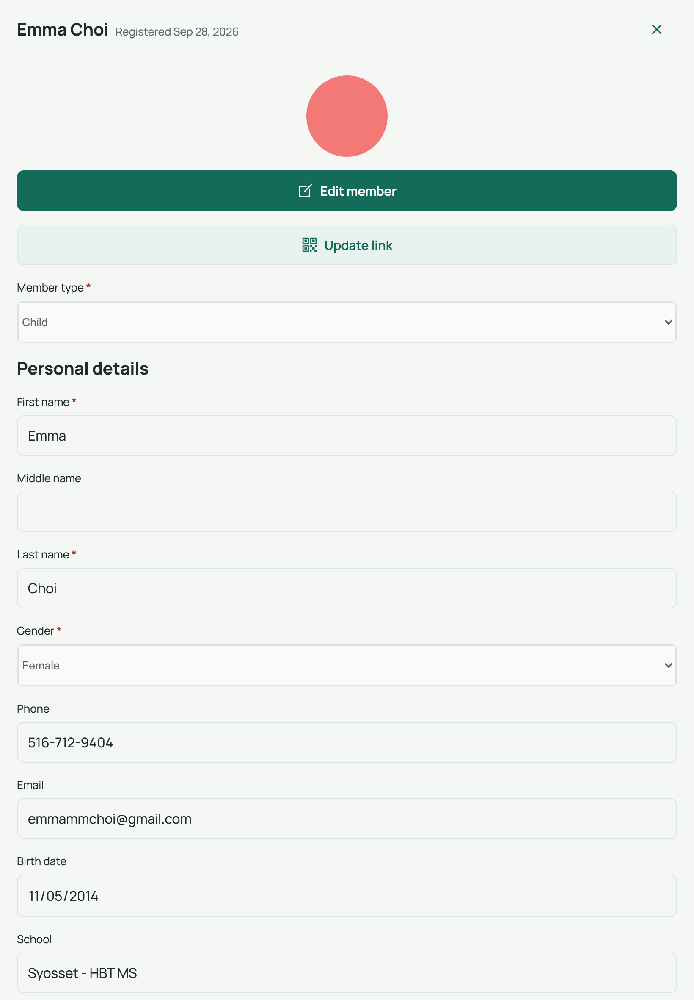
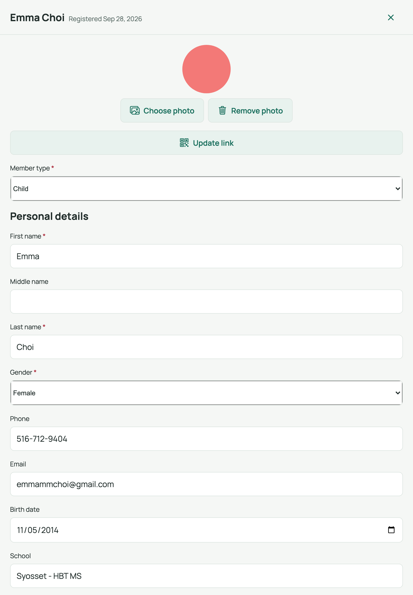
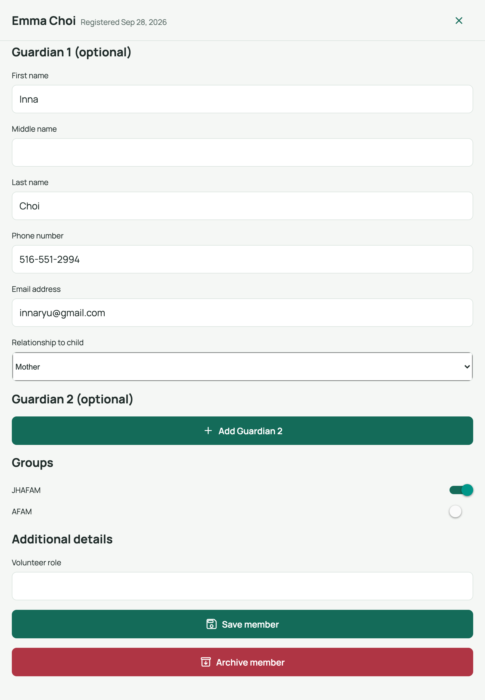

# 3. Member details: create, update, photo & groups

Create a new member or open an existing one to update their details, photo, and
group assignments.

## Opening the member screen

- **New member:** on the **Members** tab, tap the **[add] Add member** button
  (top-right header). The sheet opens in edit mode with the title *Add member*.
- **Existing member:** tap any row in the member list. The sheet opens in
  **view mode** showing the member's name and registration date; tap
  **Edit member** to make changes.

Member detail in view mode (photo, Edit member, Update link, and profile):

Edit mode (top of the form — personal details):

The **Groups** section of the form (toggle switches for each group/subgroup):

## Filling in the details

1. **Member type** — *Child* or *Adult*. Switching to *Adult* clears the school
   and guardian fields; switching to *Child* adds the guardian section.
2. **Personal details** — *First name* and *Last name* are required; gender is
   required. Phone, email, and birth date are optional.
3. **Children** — school, allergy detail, and **Guardian 1 / Guardian 2**
   (name, phone, email, and relationship: Mother, Father, Grandmother,
   Grandfather, or Others — *Others* reveals a free-text "Other relationship"
   box). Tap **+ Add Guardian 2** if a second guardian is needed, or
   **Remove Guardian 2** to delete it.
4. **Additional details** — any custom fields your church defined (text, number,
   date, or yes/no) appear here.

## Adding or changing the photo

1. Tap the photo area at the top of the sheet.
2. Choose a picture from the device (or take one, where supported).
3. The preview updates immediately.
   - **New member:** the photo is uploaded automatically right after you save.
   - **Existing member:** the photo uploads straight away.

## Assigning groups

1. Scroll to the **Groups** section.
2. Turn on the switch for each group or subgroup the member belongs to
   (subgroups appear as *Parent / Subgroup*).
3. Turn a switch off to remove the member from that group.

> If the member belongs to a group that has since been **archived**, a red note
> appears: *"Archived group assignments must be removed or replaced with active
> groups before saving."* Untick the archived group (marked "(archived)") or pick
> an active replacement, then save.

## Saving, and what can interrupt it

- Tap **Save member**. A green confirmation (*"Member saved."*) appears on the
  Members list.
- **"Reload latest version":** if someone else changed this member while you
  were editing, the app asks you to reload — your draft is replaced by the
  newest version, then re-apply your changes.
- **Closing with unsaved changes:** the sheet warns you before discarding a
  dirty form.

## Archiving a member

For an existing member, tap **Archive member** and confirm. Archived members
disappear from day-to-day lists but keep their attendance history.

## Related

- Previous: [Member list, search & export](02-member-list-search-export.md)
- Next: [Clean up duplicate members](04-clean-up-duplicate-members.md)
- Back to: [User guide index](README.md)
