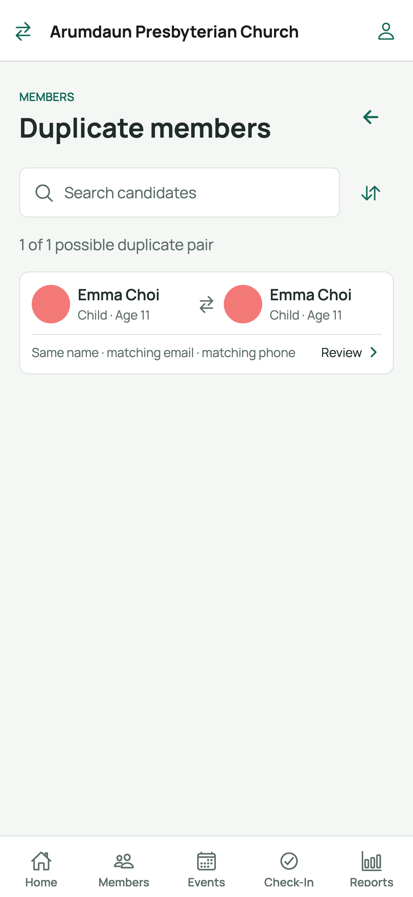
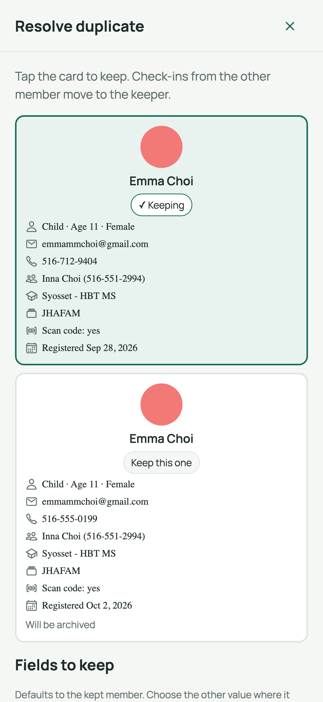
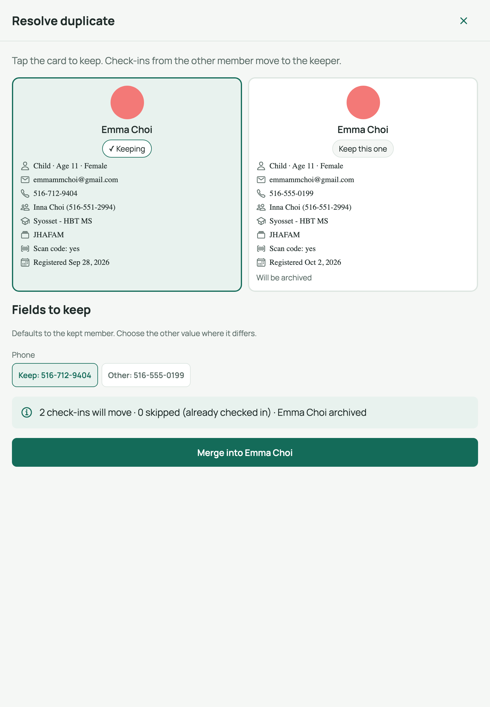

# 4. Clean up duplicate members

Use **Clean up duplicate members** to review repeated registrations and merge
each pair into one member record. The merge keeps one member, archives the
other, and moves attendance when it is not already recorded on the record you
keep.

## Opening duplicate cleanup

1. Open the **Home** tab.
2. Tap **Clean up duplicate members**.

The app lists possible pairs when two active members have the same first and
last name and share at least one contact detail, such as an email address or
phone number.

Use **Search candidates** to narrow the list, or tap the **[sort]** button to
filter pairs by group or subgroup and change name order.

> A possible pair is a prompt to review, not proof that the records belong to
> the same person. Check both profiles before merging.

## Reviewing and merging a pair

1. Tap **Review** for a possible pair. The **Resolve duplicate** sheet compares
   both member records.

**iPhone Pro Max**

**iPad**

2. Tap the member card you want to keep. The selected card is marked
   **Keeping**; the other member will be archived.
3. For fields that differ, choose whether to keep the value from the surviving
   record or use the other record's value. You can combine group assignments.
4. Review the attendance preview. It shows how many check-ins will move and how
   many are already counted on the surviving record.
5. Tap **Merge into [member name]**.
6. Read the final confirmation, then tap **Merge into [member name]** again.

### Check-in history after a merge

Check-ins are combined by event occurrence. A check-in that appears only on the
archived member transfers to the member you keep and retains its original
check-in time. If both records have a check-in for the same event occurrence,
the kept member's check-in remains and the duplicate check-in is archived. This
prevents one person from being counted twice at the same event.

The merge cannot be undone. The archived member disappears from normal member
lists but remains retained for record history. Any check-in that already exists
for the surviving member is not duplicated.

## Related

- Previous: [Member details, photo & groups](03-member-details-photo-groups.md)
- Next: [Registration QR codes](05-registration-qr-codes.md)
- Back to: [User guide index](README.md)