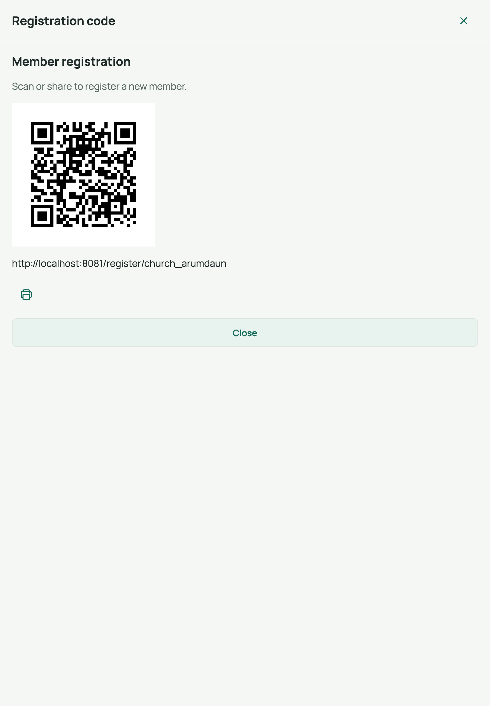
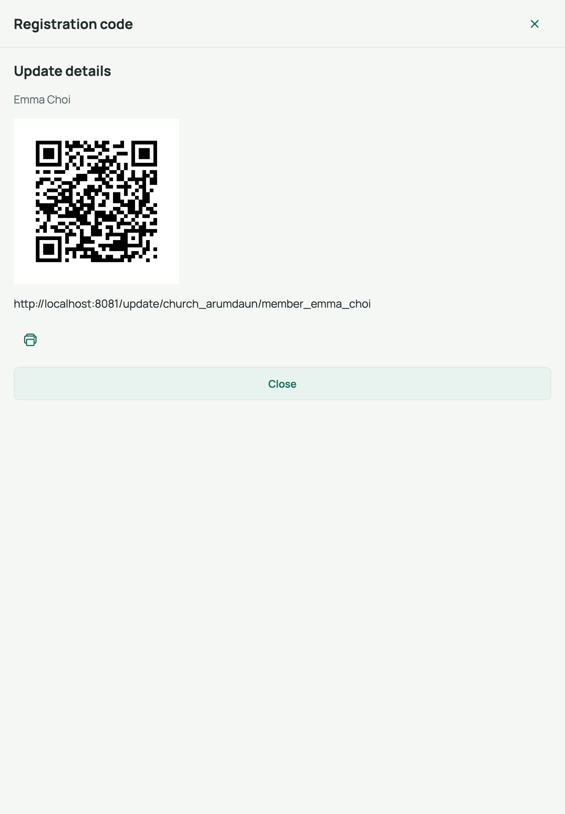
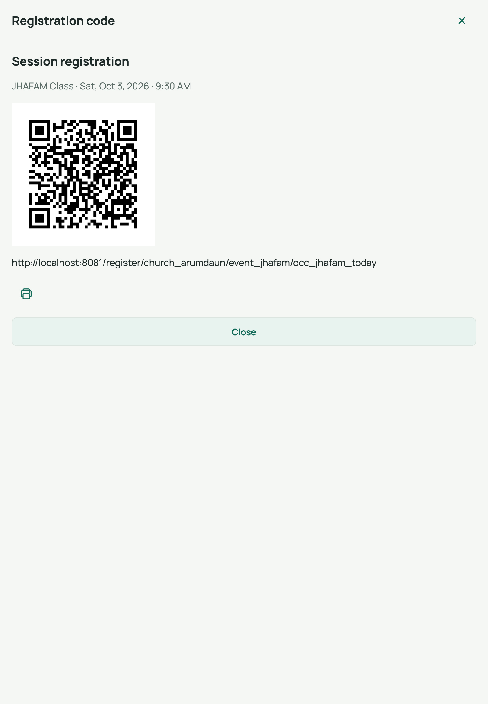

# 5. Registration QR codes

Registration QR codes let people serve themselves — no app login required. Print
the code for a lobby poster or share the link by message. There are three kinds:

| QR code | Where you generate it | What the person can do |
|---------|-----------------------|------------------------|
| **Member registration** | Members tab -> [QR] button | Register as a **new** member of your church |
| **Member update link** | Member detail -> *Update link* button | One existing member updates **their own** profile |
| **Session registration** | Check-in screen -> [QR] button | Register for a **specific event session** |

## Screen 1 — The registration code sheet

Whichever code you open, the **Registration code** sheet looks like this:

- **Print** — prints a page with the title, QR code, and link (on the web it
  opens the browser print dialog).
- **Share** — *(phones/tablets only)* creates a PDF and opens the share sheet
  so you can text, email, or AirDrop it.
- The web address is also shown in text so you can copy it.

## A. QR code to register a new member

1. Go to the **Members** tab.
2. Tap the **[QR] New registration** button (top-right header).
3. Print or share the sheet. Title: *Member registration* —
   *"Scan or share to register a new member."*

**What the family sees** (after scanning): a public **Registration** page with
your church's name — the same member form (details, guardians, groups) followed
by a **Thank you!** confirmation. New members appear in your Members list
straight away.

## B. QR code for a member to update their own profile

1. Go to the **Members** tab and tap the member's row.
2. In their detail sheet, tap **Update link**.
3. Print or share it, or hand the link to the member (for example, by email).

**What the member sees:** a public update form pre-filled with **their** current
details. They edit and submit; you can confirm the change in the app. Each
member's link is unique to them.

## C. QR code for session registration

Use this on event day so newcomers can register and be checked in to **this**
session.

1. Go to the **Check-In** tab and start a check-in session
  (see [guide 7](07-check-in.md)).
2. In the banner at the top of the check-in screen, tap the
   **[QR] New registration** button.
3. The sheet is titled **Session registration** with the event name and session
   time underneath — print or share it.

**What the person sees:** a public **Session registration** page (church name +
event/session). After they submit, the new member can be checked in to the
session immediately.

## Tips

- The QR code never expires; the same code keeps working until you delete or
  archive what it points to.
- Codes work with any phone camera — no special app needed for the person
  scanning.
- Registration pages work in any browser; people don't need the JChurch app or
  an account.

## Related

- Previous: [Clean up duplicate members](04-clean-up-duplicate-members.md)
- Next: [Events & sessions](06-events-and-sessions.md)
- Back to: [User guide index](README.md)
