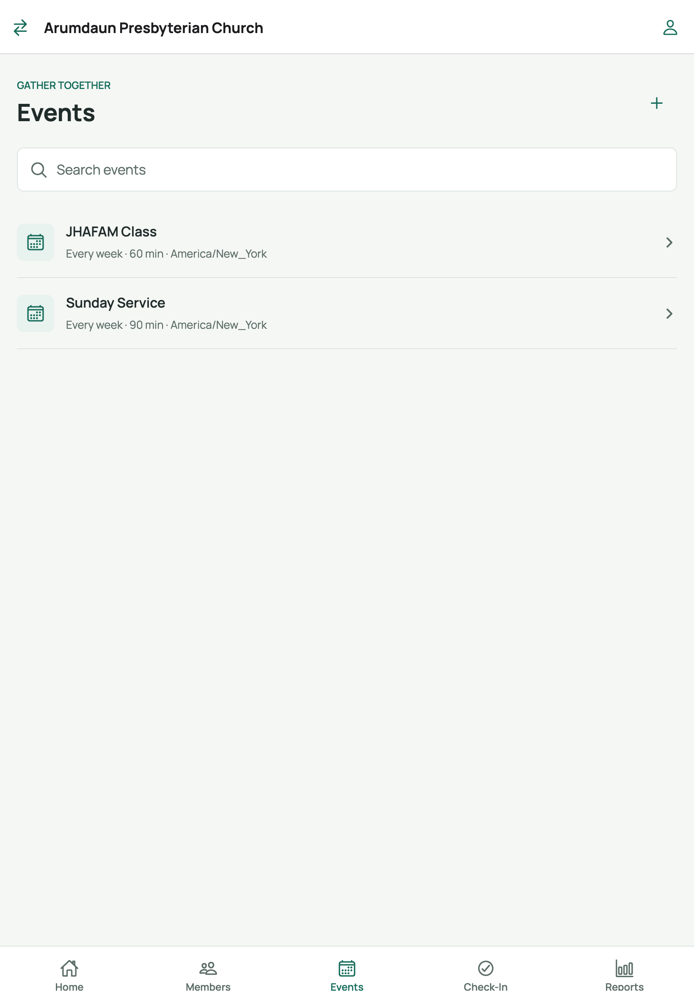
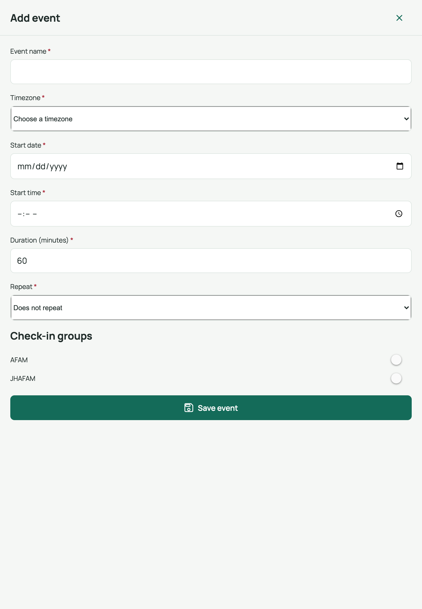
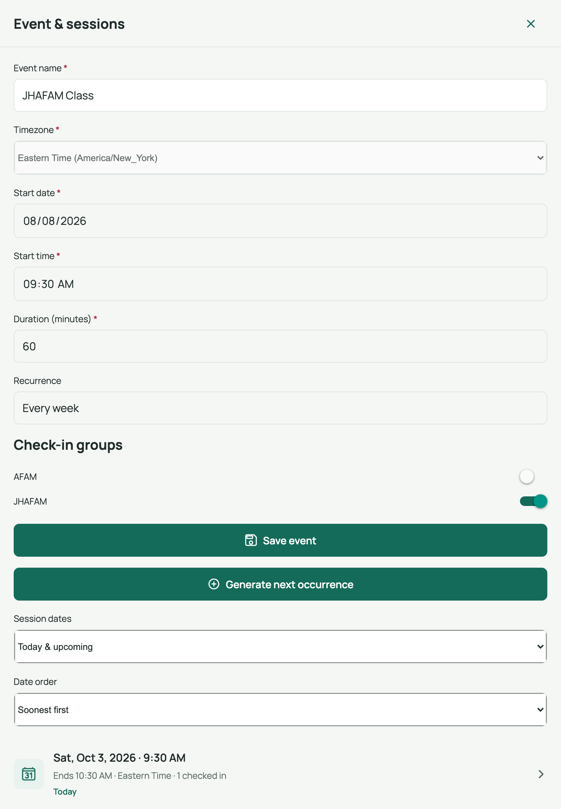
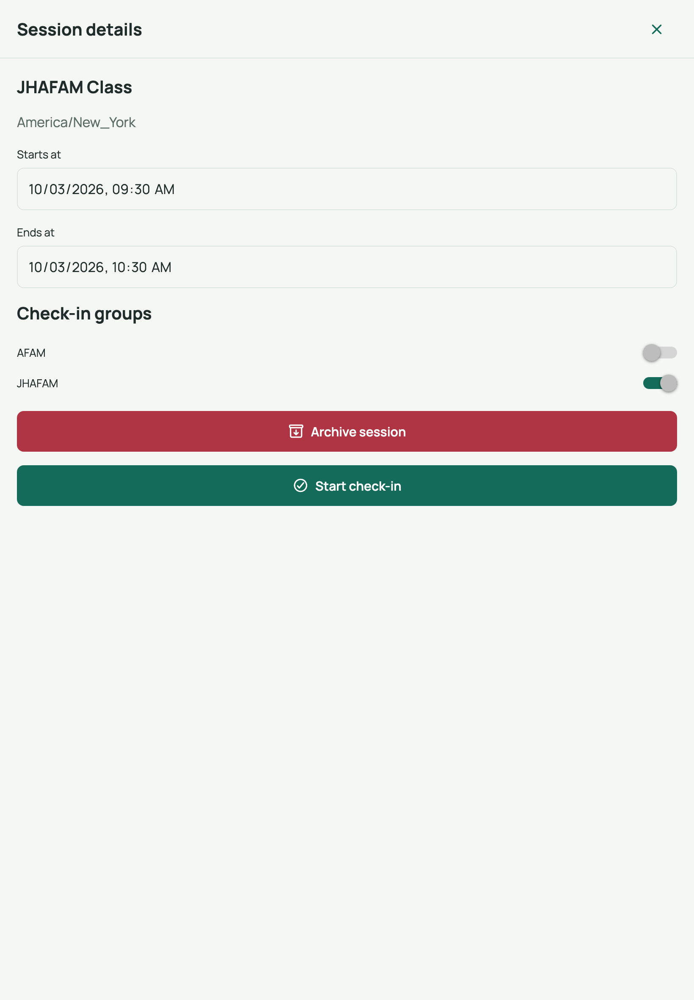

# 6. Creating events and sessions

An **event** is a recurring gathering (for example *Sunday Service* or *Kids
Club*). Each actual dated instance of the event is a **session** — that's what
people check in to.

## Screen 1 — Events list

Open the **Events** tab:

- **Search events** — filters as you type.
- Tap an event row to open it; tap **[add]** to create a new one.

## Screen 2 — Add event

Tapping **[add] Add event** opens the *Add event* sheet:

### Steps

1. Enter the **Event name** (required).
2. Pick the **Timezone** — US timezones are listed.
3. Set the **Start date** and **Start time** of the first session.
4. Set the **Duration (minutes)**.
5. Choose **Repeat**: *Does not repeat*, *Daily*, *Weekly*, *Monthly*, or
   *Yearly*.
6. Under **Check-in groups**, tick the groups allowed to check in.
   - Leave all unticked → **all members** can check in.
7. Tap **Save event**.

> **Locked after creation:** timezone, start date/time, and duration can't be
> changed later — the sheet shows them greyed out. The repeat rule is shown as
> read-only text too. Plan these before saving.

## Screen 3 — Event & sessions (editing an existing event)

Tapping an event row opens the **Event & sessions** sheet with the fields above,
plus session management below:

- **Generate next occurrence** — creates the next dated session from the repeat
  rule. Do this ahead of each gathering (the app also needs at least one
  session before check-in can start).
- **Sessions list** — switch between **Upcoming** and **Past**, and change the
  date order (soonest/latest first). Each row shows the session time, end time,
  and how many people checked in.
- **Archive event** — stops new check-ins for the whole event (asks you to
  confirm; attendance history is kept).

## Screen 4 — Session details

Tap a session row to open its **Session details** sheet:

From here you can:

- **Reschedule** — change *Starts at* / *Ends at*, then **Save session**.
- **Override groups for one session** — the session starts with the event's
  groups; adjust the switches to restrict (or open up) just this date.
- **Cancel occurrence** — blocks new check-ins for that date (confirmation
  required; existing attendance is kept). A cancelled session shows a red
  *Cancelled* badge in lists. Tap **Restore occurrence** to bring it back.
- **Archive session** — available once the session's end time has passed; it
  stays in history but can't be used for check-in. **Restore archived session**
  undoes this.
- **Start check-in** — jumps straight into the check-in flow for this session
  (see [guide 7](07-check-in.md)).

> Unsaved edits disable *Start check-in* and *Cancel* until you save — the app
> makes sure the session you check in to matches what's stored.

## Related

- Previous: [Registration QR codes](05-registration-qr-codes.md)
- Next: [Check-in & undo](07-check-in.md)
- Back to: [User guide index](README.md)
