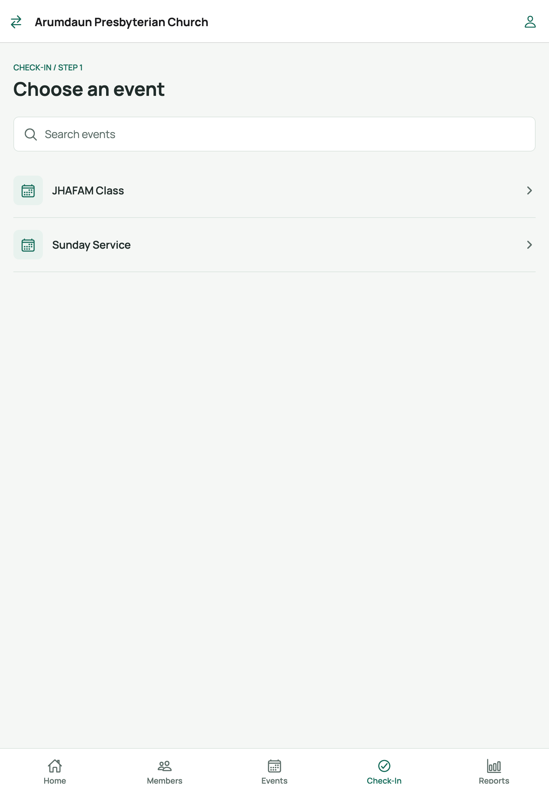
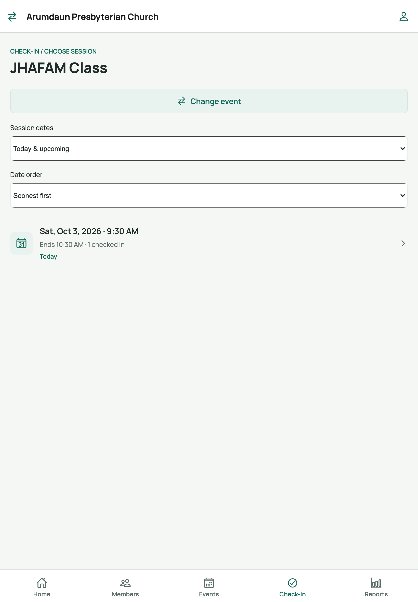
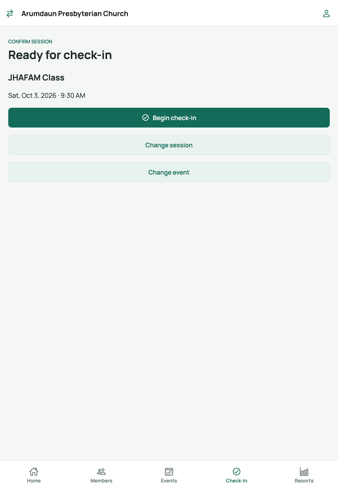
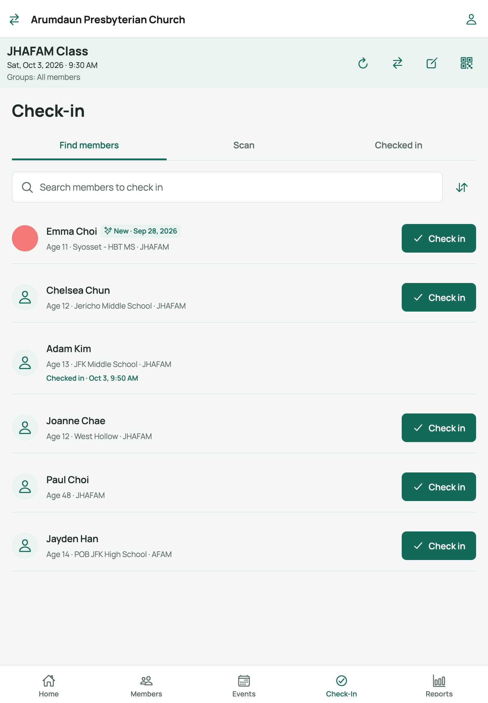
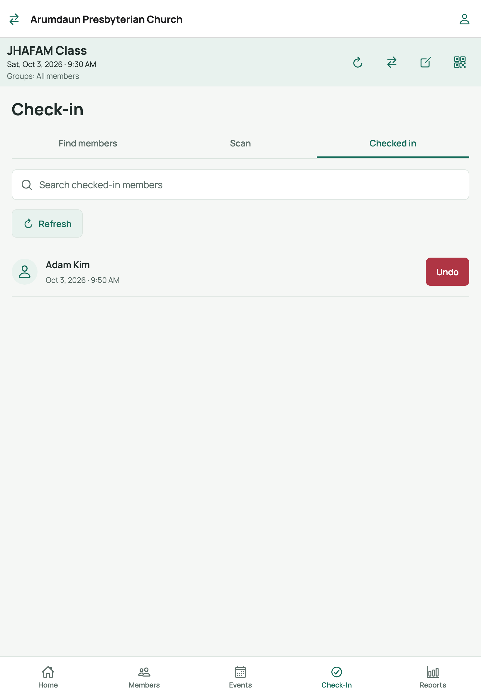
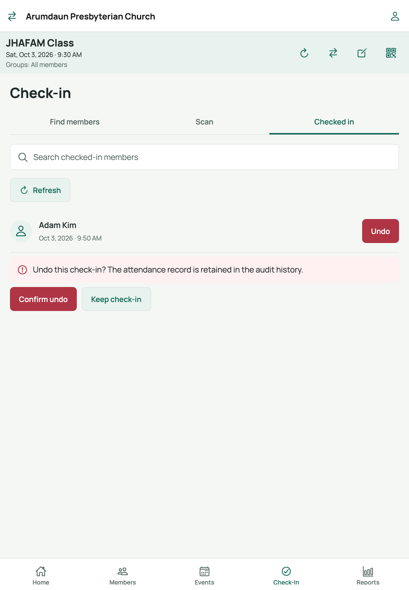

# 7. Check-in process (check in & undo)

The **Check-In** tab records who attended a session. You can check people in by
tapping their name or by scanning their QR/barcode — and undo mistakes.

## Step 1 — Choose an event

Search if needed, then tap the event.

## Step 2 — Choose the session

The screen shows the event name with its sessions (switch between **Upcoming**
and **Past** if needed):

Tap today's session. If there is no session yet, create one first
(Events tab -> event -> **Generate next occurrence**, see
[guide 6](06-events-and-sessions.md)).

## Step 3 — Confirm and begin

Tap **Begin check-in**. (If the session is cancelled, archived, or the event
is archived, the button is disabled and a red note explains why.)

## Step 4 — The check-in screen

Banner buttons (top):

| Button | Label | What it does |
|--------|-------|--------------|
| [refresh] | Refresh status | Reloads the checked-in list |
| [switch] | Change session | Back to session choice |
| [edit] | Edit session | Opens this session's details |
| [QR] | New registration | Session-registration QR code (see [guide 5](05-registration-qr-codes.md)) |

### Check in by name — *Find members* tab

1. Type in the **search box**, or use **[sort]** to filter by group or change
   the sort order (name A-Z/Z-A, created date).
2. Tap **Check in** on the member's row.
3. The button disappears and the row shows
   **Checked in - [date, time]**. If they were already recorded, it shows
   **Already checked in** — no duplicate is created.
4. If the service is busy, a note appears with a countdown —
   *"Service is busy. Retry in N seconds."* Wait, then tap **Retry** on the row.
   If a check-in's result was uncertain, retry **the same member** to recover it.

### Check in by scanning — *Scan* tab

1. Tap the **Scan** tab (visible when your church has scan codes enabled).
2. Point the camera at the member's QR code (or Code 128 barcode) card.
3. Each successful scan checks the member in automatically — keep scanning the
   next person. Members get their cards from their profile (see
   [guide 3](03-member-details-photo-groups.md)).

### See who's in — *Checked in* tab

Shows the roster of everyone checked in to this session, with the date and time
each person was recorded:

## Undo a check-in

Made a mistake? Undo keeps an audit record but removes the attendance:

1. Open the **Checked in** tab.
2. Find the person and tap **Undo** on their row.
3. Confirm the prompt:

4. Tap **Confirm undo** (red). The person disappears from the roster and can be
   checked in again if needed. Tap **Keep check-in** to back out.

## Tips for event day

- Prop the device at the door in **Scan** view for fast arrivals; use
  **Find members** for people without cards.
- Use the **[QR] New registration** code in the banner for walk-ins — they
  register on their own phone, then you check them in.
- The checked-in counts you see on session rows elsewhere in the app update as
  you go; tap **[refresh] Refresh status** if a second device is also checking
  people in.

## Related

- Previous: [Events & sessions](06-events-and-sessions.md)
- Next: [Reports](08-reports.md)
- Back to: [User guide index](README.md)
