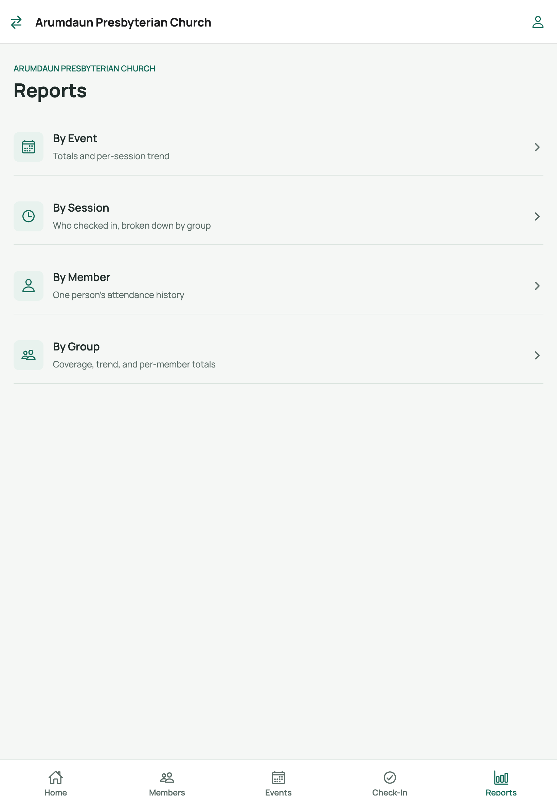
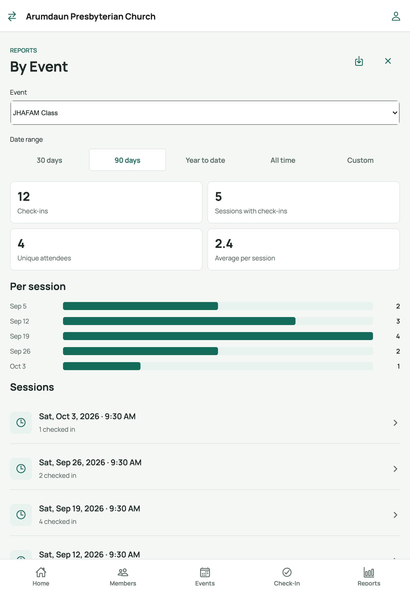
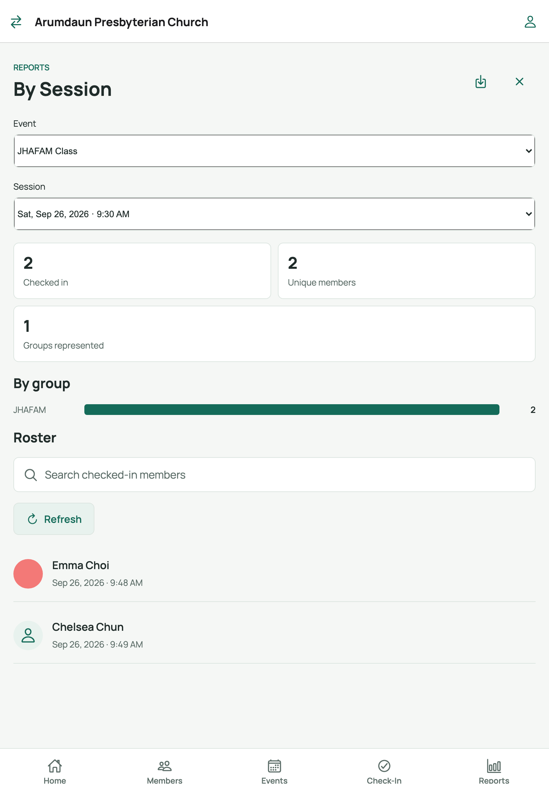
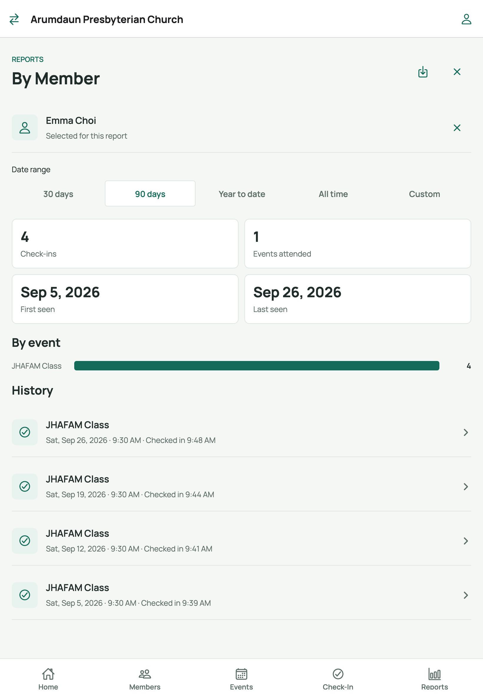
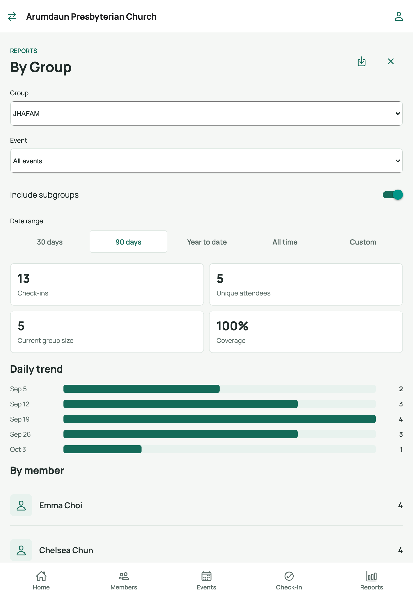

# 8. Reports: by event, session, member, and group

The **Reports** tab turns check-ins into attendance insight. All reports are
read-only and can be exported.

## Screen 1 — Reports hub

Open the **Reports** tab:

Tap the report you want. Every report shares two controls:

- **Date range** — *30 days*, *90 days*, *Year to date*, *All time*, or
  *Custom* (which reveals **From** and **To** date pickers).
- **Export menu** (top-right) — save the on-screen table as a **CSV**
  spreadsheet (downloads on web, share sheet on phones/tablets) or
  **print/PDF** the report including its headline stats and bar chart.

---

## By Event — totals and trend for one event

1. Tap **By Event**.
2. Pick the event from the **Event** dropdown (alphabetical).
3. Set the **Date range**.

- Headline **stats** summarize the range; the **bar chart** shows the per-session
  trend (the most recent sessions when there are many).
- Tap a session row to drill into its **By Session** report.
- Cancelled sessions are flagged with a red *Cancelled* badge.

## By Session — one gathering, broken down by group

1. Tap **By Session** (or drill in from the event report).
2. Choose the **event**, then the **session**.
3. You'll see who checked in (the same roster as the check-in screen, read-only)
   with a breakdown by group. Export or print from the menu if you need a
   register for the day.

## By Member — one person's history

1. Tap **By Member**.
2. Type in the **Search members** box and tap the person — they're pinned as
   *"Selected for this report."*
3. Set the **Date range**.
4. Their check-ins are listed by event and session, with totals. Export for a
   personal attendance record.

## By Group — coverage and per-member totals

1. Tap **By Group**.
2. Pick the **group** (or subgroup).
3. Set the **Date range**.
4. Review coverage stats, the attendance trend, and a **per-member totals**
   table — useful for spotting who has stopped coming.

---

## Tips

- All four reports honor the same date-range control, so comparing periods is
  easy — flip between *30 days* and *Year to date* to see momentum change.
- CSV exports open in Excel, Numbers, or Google Sheets; the print option
  produces a clean PDF-style page including the chart (on phones, the PDF lands
  in the share sheet).
- Check-in counts update live: run a report after an event to verify the
  numbers while everyone is still on site.

## Related

- Previous: [Check-in & undo](07-check-in.md)
- Back to: [User guide index](README.md)
