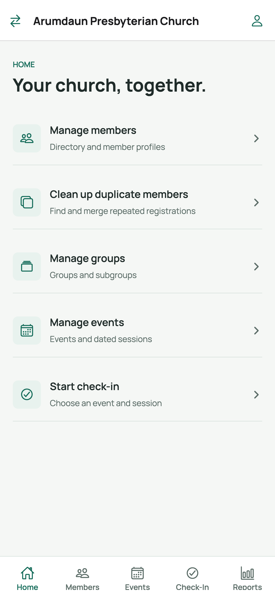

# Welcome

Welcome to the JChurch app (name tbd)— the member directory, event check-in, and attendance
reporting tool for your church. This guide walks you through each task,
screen by screen.

## Guides

| # | Guide | What you'll learn |
|---|-------|-------------------|
| 1 | [Sign in with Google](01-sign-in-with-google.md) | Log in with an invited Google account and pick your church |
| 2 | [Member list, search & export](02-member-list-search-export.md) | Find members, sort/filter, and export the directory to CSV |
| 3 | [Member details, photo & groups](03-member-details-photo-groups.md) | Create and update members, add photos, assign groups |
| 4 | [Clean up duplicate members](04-clean-up-duplicate-members.md) | Review possible duplicate registrations and merge records |
| 5 | [Registration QR codes](05-registration-qr-codes.md) | Generate QR codes for self-registration, profile updates, and session sign-up |
| 6 | [Events & sessions](06-events-and-sessions.md) | Create events, generate sessions, edit or cancel a session |
| 7 | [Check-in & undo](07-check-in.md) | Run check-in by name or scan, and undo a check-in |
| 8 | [Reports](08-reports.md) | Attendance reports by event, session, member, and group, with export |

## App orientation

After signing in and choosing a church, the app shows five tabs at the bottom:

- **Home** — quick links: members, duplicates cleanup, groups, events, check-in.
- **Members** — the member directory (see guides 2–5).
- **Events** — events and their dated sessions (see guide 6).
- **Check-In** — the check-in workflow (see guide 7).
- **Reports** — attendance reporting hub (see guide 8).

The header shows the church name, a **switch church** button ([<]) when you
belong to more than one church, and your account chip (name/photo) on the right.

> All screenshots in this guide were captured on an iPhone Pro Max screen. The app
> looks and works the same on phones and on the web; the layout adjusts to the
> screen size.

## Roles at a glance

- Some screens (for example **Groups**, **Custom fields**, **Users**, and editing
  actions) are only available to church administrators.
- Reports are read-only and visible to all signed-in users.
- Public registration/update links (guide 5) do **not** require a sign-in — they
  are opened by scanning a QR code or tapping a shared link.
